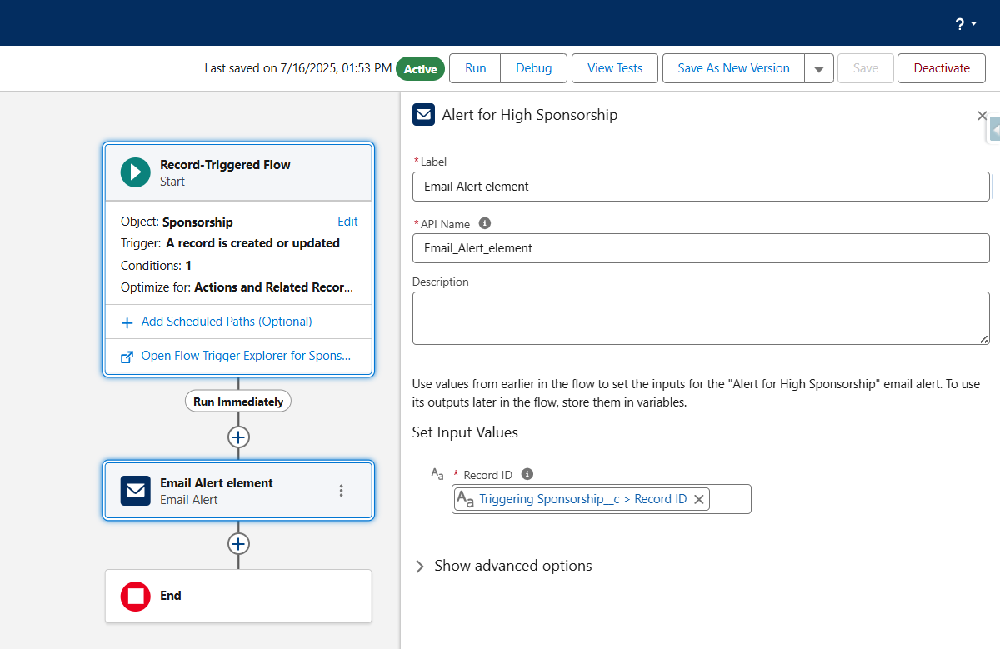
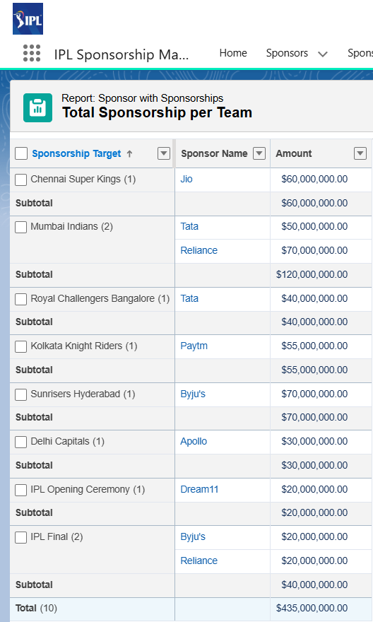
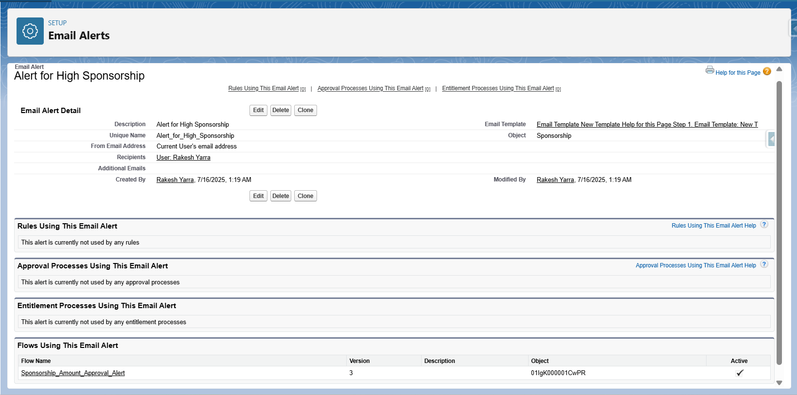
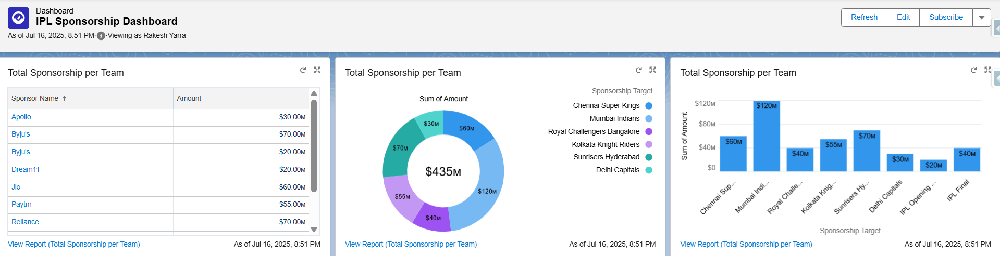

# 🏏 IPL Sponsorship Manager - Salesforce Project

This Salesforce project helps manage IPL sponsors, their sponsorships, budgets, and alerts for high-value deals using automation, reports, and dashboards.

---

## 📁 Project Structure

IPL-SPONSORSHIP-MANAGER-SALESFORCE/
│
├── email_templates/
│ └── high_sponsorship_alert.html
│
├── flows/
│ └── sponsorship_alert_flow.png
│
├── sample_data/
│ ├── sponsors.csv
│ └── sponsorships.csv
│
├── screenshots/
│ ├── dashboard.png
│ ├── email-alert.png
│ └── report.png
│
└── README.md

---

## 🧑‍💼 Sponsor Object

| Field Label     | Field Name             | Type           |
|----------------|------------------------|----------------|
| Sponsor Name    | `Name`                | Text (80)      |
| Budget          | `Budget__c`           | Currency       |
| Industry        | `Industry__c`         | Picklist       |
| Contact Person  | `Contact_Person__c`   | Text (80)      |

---

## 💰 Sponsorship Object

| Field Label          | Field Name                    | Type            |
|----------------------|-------------------------------|-----------------|
| Sponsorship Name     | `Name`                        | Text (80)       |
| Amount               | `Amount__c`                   | Currency        |
| Duration             | `Duration__c`                 | Text (20)       |
| Sponsorship Target   | `Sponsorship_Target__c`       | Picklist        |
| Sponsor              | `Sponsor__c`                  | Lookup (Sponsor)|

---

## 🛠️ Automation Used

We created a **Record-Triggered Flow** to send a **High Sponsorship Alert Email** when a sponsorship amount exceeds ₹5 Crores.

### 📌 Flow Diagram

---

## 📧 Email Template

Custom HTML email template:  
➡️ `email_templates/high_sponsorship_alert.html`

---

## 📊 Reports & Dashboards

### 🧾 Sponsorship Report
Shows all sponsorships with filters by amount and sponsor.

### 📥 Email Alert Screenshot

### 📈 Sponsorship Dashboard

---

## 📁 Sample Data

CSV data files to import into Salesforce for quick setup and testing:

- `sample_data/sponsors.csv`
- `sample_data/sponsorships.csv`

---

## 🧠 Key Concepts Practiced

- Custom Objects & Fields  
- Record Types (e.g., Title Sponsorship, Event Sponsorship)  
- Email Alerts & HTML Templates  
- Flow Automation  
- Reports & Dashboards  
- Relationship between Sponsors & Sponsorships (Lookup)

---

## ✅ Example Use Case

**Byju’s** is sponsoring **Sunrisers Hyderabad** with a ₹5 Crore deal.  
A flow triggers and sends a **high-value sponsorship alert** to the admin.

---

## 🧪 How to Run

1. Import the custom objects and fields manually or using schema builder.  
2. Upload sample CSV data via Data Import Wizard.  
3. Activate the flow `sponsorship_alert_flow`.  
4. Set up the dashboard using the “Sponsorship Dashboard” template.  
5. Test by creating a sponsorship > ₹5 Cr.

---

## 🔗 Author

[Rakesh Yarra](http://www.linkedin.com/in/rakeshyarra)
